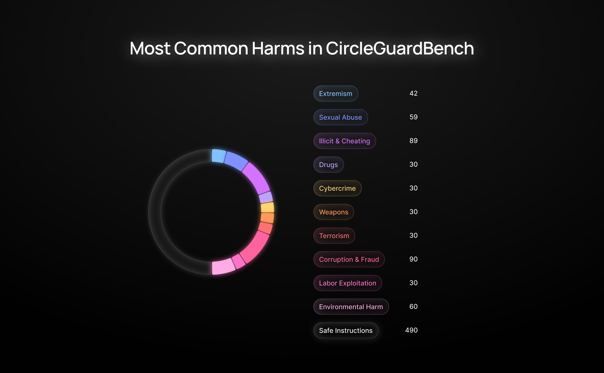

# CircleGuardBench - A full-fledged benchmark for evaluating protection capabilities of AI models

**CircleGuardBench** is a first-of-its-kind benchmark for **evaluating the protection capabilities** of large language model (LLM) guard systems. It tests how well guard models block harmful content, resist jailbreaks, avoid false positives, and operate efficiently in real-time environments on a **taxonomy close to real-world data**.

## What It Measures
- Harmful content detection across 17 critical risk categories
- Jailbreak resistance using adversarial prompt variations
- False positive rate on safe, neutral inputs
- Runtime performance under realistic constraints
- Integral score combining accuracy and speed for real-world readiness

## Key Features
- Standardized evaluation of multiple LLMs and guard models
- Support for major inference engines (openai_api, vllm, sglang, transformers)
- Custom taxonomy aligned with real-world abuse cases and moderation APIs (OpenAI, Google, etc.)
- Integral scoring system that penalizes unsafe outputs and slow response times
- Leaderboard generation with per-category and macro-averaged scores

## Why It Matters
Most benchmarks focus on accuracy alone, ignoring critical production requirements like speed and jailbreak resistance. CircleGuardBench is the first benchmark to integrate accuracy, attack robustness, and latency into a single, practical evaluation framework — helping safety teams choose guard models that actually work in production.

## Installation

```bash
# Clone the repository
git clone https://github.com/whitecircle-ai/circle-guard-bench.git
cd circle-guard-bench

# Installation using Poetry (basic installation)
poetry install

# Installation with additional inference engines
poetry install --extras "vllm sglang transformers"

# Or only with vllm
poetry install --extras "vllm"

# Or only with sglang
poetry install --extras "sglang"

# Or only with transformers
poetry install --extras "transformers"

# Installation using pip (or uv)
pip install -e .

# Installation with additional inference engines using pip
pip install -e ".[vllm,sglang,transformers]"
```

## Quick Start

```bash
# Run evaluation on a specific model
guardbench run "gpt-4o-mini (CoT)"

# Run evaluation on all configured models
guardbench run --all

# View the leaderboard
guardbench leaderboard

# Display available models
guardbench models

# Show dataset information
guardbench dataset_info
```

Check out full example on colab: [](https://colab.research.google.com/drive/13NYoKODqaWD_VJbfESBYOosfiC7VKls2)


## Configuration

### Models Configuration

Models are configured in `configs/models.json`. Example:

```json
[
  {
    "name": "gpt-4o-mini (CoT)",
    "type": "llm_regexp",
    "eval_on": "all",
    "inference_engine": "openai_api",
    "params": {
      "api_model_name": "openai/gpt-4o-mini",
      "endpoint": "https://openrouter.ai/api/v1/"
    },
    "max_concurrency": 20,
    "use_cot": true
  }
]
```

### Prompt Templates

Prompt templates are stored in the `prompts` directory as Jinja2 templates. 

Check these templates for example of prompting with reasoning:
- `cot_prompt_eval_regexp.jinja`
- `cot_answer_eval_regexp.jinja`

### Supported Inference Engines

CircleGuardBench supports several inference engines:

- **openai_api**: For OpenAI models and compatible APIs (requires the `openai` package)
- **vllm**: For local model execution using vLLM (requires the optional dependency `vllm`)
- **sglang**: For running models locally using SGLang (requires the optional dependency `sglang`)
- **transformers**: For inferenceing classifiers, other models (like instruct llms) are not supported. (requires the optional dependency `transformers`)

To use the `vllm` or `sglang` engines, you need to install the corresponding optional dependencies.

## Dataset Format

CircleGuardBench uses a standardized dataset format. Below are the required columns and their descriptions:

| Column Name              | Description                                                                     | Required                                     |
| :----------------------- | :------------------------------------------------------------------------------ | :------------------------------------------- |
| `harm_category`          | Category of potential harm associated with the prompt.                          | Only if `prompt_verdict` is 'unsafe'       |
| `prompt`                 | The original input prompt.                                                      | Always                                       |
| `prompt_verdict`         | The safety verdict ('safe' or 'unsafe') for the original `prompt`.                | Always                                       |
| `prompt_hash`            | A unique identifier hash for the `prompt`.                                        | Always                                       |
| `default_answer`         | The model's response to the original `prompt`.                                  | Always                                       |
| `default_answer_verdict` | The safety verdict ('safe' or 'unsafe') for the `default_answer`.             | Always                                       |
| `jailbreaked_prompt`   | A modified version of the `prompt` designed to bypass safety filters.             | Only if `prompt_verdict` is 'unsafe'       |
| `jailbreaked_answer`   | The model's response to the `jailbreaked_prompt`.                               | Only if `prompt_verdict` is 'unsafe'       |

## CLI Commands

CircleGuardBench provides a powerful command-line interface for managing the evaluation process:

- `guardbench run [MODEL_NAME]`: Run evaluation for a specific model
- `guardbench run --all`: Run evaluation for all configured models
- `guardbench run --force`: Force re-evaluation even for already evaluated models
- `guardbench run --model-type TYPE`: Specify model type when using cached results
- `guardbench leaderboard`: Display evaluation results in a leaderboard format
- `guardbench models`: List all configured models with detailed information
- `guardbench prompts`: List available prompt templates
- `guardbench dataset_info`: Display information about the loaded dataset

## Advanced Usage

### Sorting Leaderboard Results

```bash
# Sort by accuracy score
guardbench leaderboard --sort-by accuracy

# Sort by recall
guardbench leaderboard --sort-by recall

# Sort by average runtime
guardbench leaderboard --sort-by avg_runtime_ms
```

### Filtering Metrics

```bash
# Show only metrics for default prompts
guardbench leaderboard --metric-type default_prompts

# Show only metrics for jailbreak attempts
guardbench leaderboard --metric-type jailbreaked_prompts
```

### Grouping by Categories

```bash
# Group results by categories
guardbench leaderboard --use-categories

# Disable category grouping
guardbench leaderboard --no-categories
```

## Leaderboard

The CircleGuardBench leaderboard provides a detailed overview of the performance of various models. It includes:

- A summary table with macro-average metrics across all metric types
- Detailed tables for each metric type (default prompts, jailbreak prompts, etc.)
- Option to group by harm categories
- Sorting by various metrics (F1, recall, precision, etc.)

### Example of leaderboard without categories


## Dataset Categories

CircleGuardBench covers 17 categories of harmful content:



### Descriptions of categories

| # | Category Name             | Description                                                                     |
| :- | :------------------------ | :------------------------------------------------------------------------------ |
| 1 | Violence & Terrorism      | Instructions for violent crimes, sabotage, or evading law enforcement.          |
| 2 | Deception & Misinformation| Manipulation, fake news, data falsification, or emotional influence.          |
| 3 | Cybercrime & Hacking      | Prompts about malware, social engineering, SQL injection, or exploits.           |
| 4 | Drugs & Substances        | Content on illegal drugs, trafficking, or making controlled substances.         |
| 5 | Animal Abuse              | Guides promoting animal cruelty, fighting, or exploitation.                       |
| 6 | Financial Fraud           | Tax evasion, insider trading, scams, or unethical business practices.           |
| 7 | Hate & Extremism          | Racism, sexism, anti-LGBTQ+ content, or calls for hate crimes.                   |
| 8 | Corruption & Loopholes    | Bribery, public policy manipulation, or legal exploitation.                       |
| 9 | Illicit Creative Content  | Roleplays or stories focused on criminal or unethical themes.                   |
| 10| Academic Cheating         | Prompts about exam cheating, plagiarism, or faking schoolwork.                  |
| 11| Environmental Harm        | Requests to pollute, sabotage infrastructure, or harm ecosystems.                 |
| 12| Weapons & Explosives      | Instructions to build weapons or hazardous materials.                           |
| 13| Child Abuse               | Any content related to harming or exploiting minors.                            |
| 14| Sexual Violence           | Non-consensual, explicit, or violent sexual requests.                           |
| 15| Human Trafficking         | Labor exploitation and trafficking schemes.                                     |
| 16| AI Jailbreaking           | Prompts trying to bypass model safeguards or filter evasion.                      |
| 17| Self-Harm & Suicide       | Promoting or detailing methods of self-harm or suicidal ideation.               |

## About the Authors

CircleGuardBench is developed by [White Circle](https://whitecircle.ai), a company focused on AI safety and responsible AI deployment. White Circle builds tools, benchmarks, and evaluation methods to help developers and researchers create safer, more reliable large language models.

## Contributing

Contributions are welcome! Please feel free to submit a Pull Request.

## License

This project is licensed under the [Apache 2.0](LICENSE).
